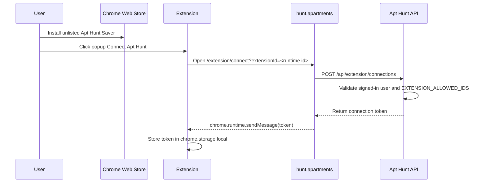

# Unlisted Chrome Extension Publishing Design

## Goal

Make the Apt Hunt Facebook saver extension installable through an unlisted Chrome Web Store listing, while keeping local developer setup available but hidden from normal users.

This is a publishing-prep feature, not full Chrome Web Store automation. The first upload, listing metadata, privacy disclosures, visibility selection, and review submission still happen manually in the Chrome Developer Dashboard.

## Current State

- The extension lives in `extension/` and can be loaded manually through `chrome://extensions`.
- `extension/config.js` points at `http://localhost:3333`.
- `extension/manifest.json` only allows website-to-extension messages from `http://localhost/*`.
- The app sidebar exposes developer setup text: load unpacked, copy extension id, set `EXTENSION_ALLOWED_IDS`, restart.
- Production extension connection also requires the Chrome Web Store extension id to be present in `EXTENSION_ALLOWED_IDS`.

## Requirements

### Extension Package

- Add a repeatable package command, `npm run extension:pack`, that creates a Chrome Web Store upload zip from `extension/`.
- The package command must fail if required extension files are missing or if the manifest is invalid JSON.
- The package command must exclude transient files such as `.DS_Store`, source maps, existing zips, and local developer notes.
- Output should be written to a predictable ignored path, for example `dist/extensions/apt-hunt-saver-<version>.zip`.
- Add `dist/` to `.gitignore` if it is not already ignored.
- The generated zip must have `manifest.json` at the zip root, not inside an `extension/` wrapper directory.
- The package command must validate the zip root layout after writing the archive and fail if root `manifest.json`, `background.js`, `popup.html`, or other required root files are missing.

### Production Extension Configuration

- The Chrome Web Store package must point at `https://hunt.apartments`.
- The production package `host_permissions` must include `https://hunt.apartments/*` so the extension service worker can call Apt Hunt APIs from the extension origin.
- The production package `externally_connectable.matches` must include `https://hunt.apartments/*` so the website can send the connection token to the installed extension.
- Production packages must strip `http://localhost/*` from `host_permissions` and `externally_connectable.matches` by default.
- Local unpacked development must remain possible against `http://localhost:3333`.
- Implement this with a small packaging step that rewrites a copied extension directory for production before zipping, rather than asking developers to edit `extension/config.js` by hand.
- The packaged manifest must preserve Chrome's valid localhost pattern for dev only when producing a dev package. Production packages should not require localhost access unless explicitly requested.

### Icons

- Add PNG extension icons and wire them into `manifest.json`.
- Include at least `16`, `48`, and `128` sizes. Chrome documentation specifically calls out `128x128` for installation and the Chrome Web Store, `48x48` for `chrome://extensions`, and `16x16` for extension page favicon usage.
- Do not use SVG or WebP as manifest extension icons.

### App Discovery UX

- For signed-in users, replace the default visible developer instructions with a user-facing install/connect flow:
  - If no store URL is configured: show that the extension is not ready for public install yet.
  - If `NEXT_PUBLIC_CHROME_EXTENSION_URL` is configured and valid: show an `Install Chrome Extension` link.
  - Always show `Connect extension` guidance after install.
  - Keep `Developer setup` in a collapsed disclosure with the unpacked-install and `EXTENSION_ALLOWED_IDS` steps.
- For signed-out users, keep the current sign-in-first flow.
- Use compact copy that avoids implementation details unless the developer disclosure is opened.
- Validate `NEXT_PUBLIC_CHROME_EXTENSION_URL` before rendering it. V1 should accept HTTPS Chrome Web Store detail URLs on `chromewebstore.google.com`; it may also accept the legacy `chrome.google.com/webstore/detail/` form. Missing or invalid values must not render as clickable install links.

### Server Allowlist

- Keep `EXTENSION_ALLOWED_IDS` as the server-side ownership check.
- After the first Chrome Web Store upload, the store-assigned extension id must be added to production `EXTENSION_ALLOWED_IDS`.
- Local unpacked extension ids may be added to local `.env.local` only.
- Support comma-separated ids as today.

### Publishing Documentation

Add `docs/extension-publishing.md` with:

1. Run package command.
2. Register/open Chrome Developer Dashboard.
3. Upload the generated zip.
4. Fill store listing, screenshots, privacy fields, support/contact fields.
5. Fill the Chrome Dashboard Test instructions tab with reviewer steps.
6. Choose `Unlisted` visibility.
7. Submit for review.
8. Copy the Chrome Web Store extension id.
9. Add the id to Vercel production `EXTENSION_ALLOWED_IDS`.
10. Wait for Chrome Web Store approval and item publication.
11. Add the published item URL to `NEXT_PUBLIC_CHROME_EXTENSION_URL`.
12. Redeploy and smoke test install/connect/save.

The doc must explain that unlisted listings are installable by anyone with the link but do not appear in Chrome Web Store search, and that all submissions still go through Chrome Web Store review.

The doc must explicitly warn not to expose the install link in Apt Hunt until the item is approved and installable. `EXTENSION_ALLOWED_IDS` may be configured before approval because it does not expose an install link to users.

Reviewer test instructions must include:

- Apt Hunt URL: `https://hunt.apartments`.
- A deterministic sign-in path. V1 must either provide a dedicated reviewer Google account/workspace or a reviewer test mode that does not require private product data. The chosen path must be written in the Chrome Dashboard Test instructions before submission.
- Connection steps: install extension, open popup, click `Connect Apt Hunt`, sign in if prompted, approve the extension connection page.
- A deterministic Facebook test context. V1 must either point reviewers at a clearly public Facebook page/post context that does not depend on private group membership, or provide an alternate reviewer fixture page that exercises the same content-script save/review flow without requiring private Facebook access. The chosen path must be written in the Chrome Dashboard Test instructions before submission.
- Expected result: the review popup appears, incomplete fields can be saved, and a successful save appears in Apt Hunt listing state.
- Note that the extension does not collect Facebook credentials and only reads visible post content from pages the signed-in browser user can already access.

## Data And Runtime Flow

## Testing

- Unit test package helper behavior where practical:
  - copies required extension files;
  - rewrites production origin;
  - includes production `host_permissions` origin;
  - strips localhost from production `host_permissions`;
  - includes production `externally_connectable` origin;
  - strips localhost from production `externally_connectable`;
  - validates manifest icon entries for `16`, `48`, and `128`;
  - validates referenced icon files are PNGs included in the zip;
  - validates referenced icon PNG dimensions match their manifest keys;
  - validates generated zip has root `manifest.json` with no wrapping directory;
  - fails on invalid manifest.
- Unit test `ExtensionDiscoveryCard`:
  - signed-out users see sign-in;
  - signed-in users with no store URL see "not ready" copy and developer disclosure;
  - signed-in users with store URL see install link and developer disclosure;
  - signed-in users with invalid store URL do not see a clickable install link.
- Run `npm run lint`, `npm run typecheck`, and focused unit tests.
- Manually verify generated zip contents before first upload.

## Non-Goals

- Automating Chrome Web Store submission through the publish API.
- Building a full extension update pipeline.
- Removing local unpacked development.
- Making the extension public/searchable in the Chrome Web Store.
- Replacing `EXTENSION_ALLOWED_IDS` with a different ownership model.

## External References

- Chrome Web Store publish flow: https://developer.chrome.com/docs/webstore/publish
- Chrome Web Store distribution visibility: https://developer.chrome.com/docs/webstore/cws-dashboard-distribution
- Chrome extension manifest icons: https://developer.chrome.com/docs/extensions/reference/manifest/icons
